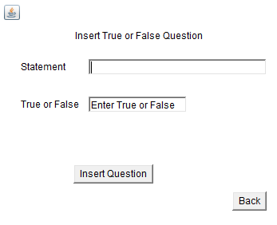

# Quiz-management-system-Java-
Consists of user and admin pages. Two subject Physics and Chemistry. Admin can add, delete and modify 
questions. Questions can be MCQ, Fill in the blank or true or false. User can write a quiz in the chosen 
subject with chosen number of questions. Random questions will be picked from the pool of questions for 
the user.

